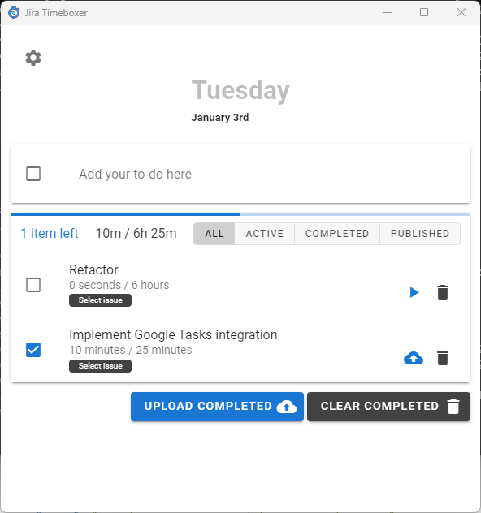

# Jira Timeboxer



Electron based time tracking app, that allows you to log hours into Jira issues. The project has began as a timer app for OpenProject, another open source issue tracker, but was later rewritten to work with Jira's Tempo.

## Disclaimer

I've been developing this in an attempt to learn JS and Node in particular, without any prior programming experience. The app works 😅 But given I've switched back to gamedev and had no time to keep up with web development, the app needs some love:

1. Most node modules are outdated, if not all
2. The app needs refactoring, as I've been stackoverflowing quite a bit along the way
3. I've never got to implement Google Tasks integration. As I was building the app for my team and myself (was working as a Project Manager at my day job; hence the time tracking app), Google's GSuite was the main "office" software where I was working at the time. Given it's still one of the most popular suites, I think it could be the next feature to add.
4. Ugly app icon needs to be replaced

## Stack

- Electron
- Vue + vuex + vue-router
- Vuetify
- NeDB for persistent storage

More details in `package.json`.

## Develop

Install the dependencies and devDependencies, run Electron dev server.

```sh
$ cd jira-timeboxer
$ npm install -d
$ npm run dev
```

## Build

1. Install Node for your OS, clone this repository and `cd jira-timeboxer`.
2. Install dependencies with `npm i`
3. Depending on the target platform, use below commands to build an installer.

```sh
$ npm run build:win
$ npm run build:linux
$ npm run build:mac
```
Ready for installation app will be available in the `build` directory.
